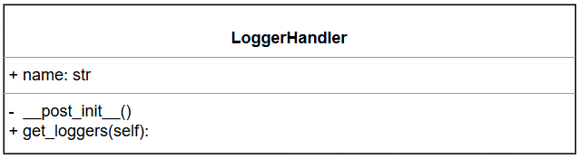
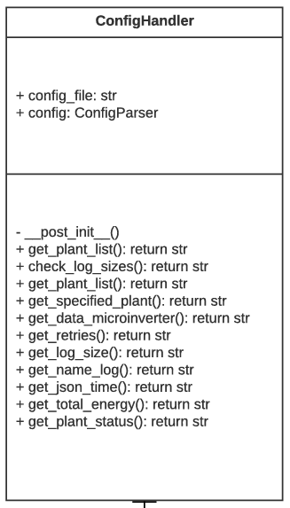
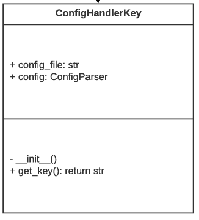

<h1 align="center">Residential monitoring in ENRG using DTU and API. 
</h1>

<p align="center">

</p>

<!-- TABLE OF CONTENTS -->
<details open="open">
    <summary>Table of Contents</summary>
    <ol>
        <li><a href="#about-the-project">About the project</a></li>
        <li><a href="#Funcionamiento_general">General operation</a>
            <ul>
                <li><a href="#structure_project">Project structure </a></li>
                <li><a href="#app">App</a></li>
                <li><a href="#utils">Utils</a></li>
            </ul>
        </li>
        <li><a href="#diagrams"> UML Diagram 
        </a></li>
        <li><a href="#requirements">Installation requirements </a></li>
        <li><a href="#License">License</a></li>
        <li><a href="#Derechos">Copyrights</a></li>
    </ol>
</details>


<p id="about-the-project">
</p>


## About the project

<div style="text-align:justify">

A script-like application has been developed for collecting and sending information about power generation in multiple photovoltaic plants operating with microinverters of the company Hoymiles. Currently, the data from these microinverters are stored in the Hoymiles database.

This project arises with the objective of taking advantage of Hoymiles' own API to query the power generation information of the microinverters and transfer it to Erco Energy's database. In this way, the integration of this data into the monitoring platform is facilitated, allowing a more efficient tracking of energy performance.
</div>


<p id="Funcionamiento_general">
</p>

# General operation

## Description  
This project has a main script in charge of the application execution. It defines the classes and methods needed to collect Hoymiles data, process it and send it to Erco Energy's monitoring database.  


<p id="structure_project">
</p>

## Project structure

<p id="app">
</p>

### 📂 `App`  
El sistema incluye una clase principal que se encarga de la consulta y procesamiento de datos, una clase para la gestión de tokens y una clase adicional para el envío de la información al servidor de ENRG.


### 📂 `utils`  
It contains reusable classes and methods within the project.  

  

<p id="diagrams" >
    
</p>

## Diagrams UML

Este diagrama UML describe las clases y métodos de la aplicación, organizados en diferentes módulos para gestionar la configuración, el registro de datos y las claves cifradas. A continuación se describe cada una de las clases y sus relaciones.


<p align="center">

</p>

Fetching data from hoymiles API.

    HoymileReport class provides functionality to interact with the Hoymiles API
    to fetch, cache, and process information about plants and their microinverters.

    This class is designed to:
    - Fetch and cache a list of plants.
    - Fetch and cache microinverters associated with each plant.
    - Fetch daily generation data for each microinverter.
    - Retrieve additional information such as total energy generated and plant status.

    Attributes:
        logger (logging.Logger): Logger instance for capturing logs and errors.
        config_data (ConfigHandler): Configuration object with API URLs, retry policies, etc.
        key (str): API key for authenticating requests.
        hour (int): Current hour used to determine cache refresh logic.
        MAX_RETRIES (int): Max attempts to retry API calls on failure (set during initialization).

    Methods:
        __post_init__():
            Loads MAX_RETRIES from configuration.

        get_list_plants() -> list:
            Retrieves a list of solar plants from the Hoymiles API.
            Caches results in a local JSON file and refreshes data based on the current hour.

        get_list_microinverters_per_plant() -> list:
            For each plant, retrieves the list of microinverter serial numbers.
            Caches results and refreshes them based on the configured hour.

        get_data_microinverters_per_plant() -> list:
            For each plant and its microinverters, retrieves generation data,
            total energy, and plant status.

        __get_total_energy(id_plant: int) -> str:
            Retrieves the total energy generated for a given plant ID.

        __get_plant_status(id_plant: int) -> dict:
            Retrieves the status of a given plant (e.g., online/offline).

<p align="center">

</p>

Manages log file size and ensures it does not exceed a defined limit.

    Manages log file size and ensures it does not exceed a defined limit.

    Attributes:
        LOG_FILE (str): Path to the log file.
        MAX_LOG_SIZE (int): Maximum allowed log file size in bytes.

    Methods:
        check_log_sizes(): Deletes the log file if it exceeds the maximum size.
    


<p align="center">

</p>


Manages log file size and ensures it does not exceed a defined limit.


    
    Handles application configuration using configparser.

    Attributes:
        config_file (str): Path to the configuration file.
        config (configparser.ConfigParser): Parser instance for reading configuration.

    Methods:
        get_url() -> str:
            Returns the base API endpoint URL from the config.
        
        get_plant_list() -> str:
            Returns the endpoint for retrieving the plant list.
        
        get_specified_plant() -> str:
            Returns the endpoint for retrieving a specified plant's data.
        
        get_data_microinverter() -> str:
            Returns the endpoint for retrieving microinverter data.
        
        get_total_energy() -> str:
            Returns the endpoint for retrieving total energy data.

        get_plant_status() -> str:
            Returns the endpoint for retrieving plant status.

        get_url_token() -> str:
            Returns the endpoint for obtaining a token.
        
        get_url_enrg() -> str:
            Returns the endpoint for the energy report.
        
        get_retries() -> str:
            Returns the maximum number of retries from settings.
        
        get_log_size() -> str:
            Returns the log file size limit from settings.
        
        get_name_log() -> str:
            Returns the log file name from settings.
        
        get_json_time() -> str:
            Returns the JSON timestamp format from settings.
        
        get_interval_time() -> int:
            Returns the time interval (in seconds or minutes) from settings.
    


<p align="center">

</p>


Handles application configuration using configparser.

### Attributes:
- **config_file** (str): Path to the configuration file.
- **config** (configparser.ConfigParser): ConfigParser instance.

### Methods:
- **get_url() -> str**: Returns the API endpoint URL.
- **get_plant_list() -> str**: Returns the plant list endpoint.
- **get_specified_plant() -> str**: Returns the specified plant endpoint.
- **get_data_microinverter() -> str**: Returns the microinverter data endpoint.
- **get_retries() -> str**: Returns the maximum number of retries.
- **get_log_size() -> str**: Returns the log file size limit.
- **get_name_log() -> str**: Returns the log file name.

<p align="center">

</p>

Extends ConfigHandler to handle encrypted keys.

### Methods:
- **get_key() -> str**: Returns the decrypted key.


<p id="requirements" >
    
</p>

## Requerimientos instalación
To use this project, the following requirements must be met: 

1. **Python 3.9 o superior** must be installed on the system.    
2. Ask the person in charge for the `key.ini` file, which contains the API Key needed to use the Hoymiles application.  
3. Install the required libraries by executing the following command in the terminal:  

   ```sh
   pip install -r requirements.txt


<p id="License">
</p>

## Licences

This project has been developed using **open source programming language and libraries**. No additional licenses were required for its implementation.  

<p id="Derechos" >
    
</p>

## Copyrights

All rights reserved for Erco Energy 2025.
