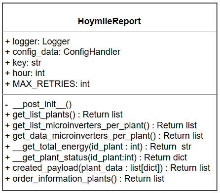
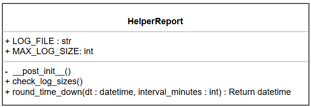

<h1 align="center">Residential monitoring in ENRG using DTU and API. 
</h1>

<p align="center">

</p>

<!-- TABLE OF CONTENTS -->
<details open="open">
    <summary>Table of Contents</summary>
    <ol>
        <li><a href="#about-the-project">About the project</a></li>
        <li><a href="#Funcionamiento_general">General operation</a>
            <ul>
                <li><a href="#structure_project">Project structure </a></li>
                <li><a href="#app">App</a></li>
                <li><a href="#utils">Utils</a></li>
            </ul>
        </li>
        <li><a href="#diagrams"> UML Diagram 
        </a></li>
        <li><a href="#requirements">Installation requirements </a></li>
        <li><a href="#License">License</a></li>
        <li><a href="#Derechos">Copyrights</a></li>
    </ol>
</details>


<p id="about-the-project">
</p>


## About the project

<div style="text-align:justify">

A script-like application has been developed for collecting and sending information about power generation in multiple photovoltaic plants operating with microinverters of the company Hoymiles. Currently, the data from these microinverters are stored in the Hoymiles database.

This project arises with the objective of taking advantage of Hoymiles' own API to query the power generation information of the microinverters and transfer it to Erco Energy's database. In this way, the integration of this data into the monitoring platform is facilitated, allowing a more efficient tracking of energy performance.
</div>


<p id="Funcionamiento_general">
</p>

# General operation

## Description  
This project has a main script in charge of the application execution. It defines the classes and methods needed to collect Hoymiles data, process it and send it to Erco Energy's monitoring database.  


<p id="structure_project">
</p>

## Project structure

<p id="app">
</p>

### 📂 `App`  
It contains the main class in charge of querying and processing data.  

#### **Clase `HoymileReport`**  
- `get_list_plants()`: Returns the plants associated with the Hoymiles account.    
- `get_list_microinverters_per_plant()`: Consult the list of plants and return those with their respective microinverters.  
- `get_data_microinverters_per_plant()`:  
  - Obtains power generation information for each microinverter.  
  - Stores data organized by plant.   
  - Returns a list with the collected information.  
- `information_processing()`: Processes the collected information and structures it in the appropriate format for submission to Erco Energy's database.

<p id="utils">
</p>

### 📂 `utils`  
It contains reusable classes and methods within the project.  

- **`LoggerHandler`**: Logs errors, general information and debugging messages.
- **`ConfigHandler`**: Gets data from the file `config.ini`, including the URLs needed to query the Hoymiles API.  
- **`ConfigHandlerKey`**: Manages the authentication key required for querying the Hoymiles API. **For security reasons, this key is not available directly in the project.**
**  

## 📌 Target  
  
Ensure the correct integration and transfer of power generation data from Hoymiles to Erco Energy's database, facilitating its monitoring and analysis. 


<p id="diagrams" >
    
</p>

## Diagrams UML

Este diagrama UML describe las clases y métodos de la aplicación, organizados en diferentes módulos para gestionar la configuración, el registro de datos y las claves cifradas. A continuación se describe cada una de las clases y sus relaciones.


<p align="center">

</p>

Fetching data from hoymiles API.

### Attributes:
- **LOG_FILE** (str): Path to the log file.
- **MAX_LOG_SIZE** (int): Maximum allowed log file size in bytes.
- **logger** (logging.Logger): Logger instance for saving class logs.
- **config_data** (ConfigHandler): Config instance for getting query settings.
- **key** (str): API key for fetching data from Hoymiles API.
- **hour** (int): Current date for fetching data.

### Methods:
- **__post_init__()**: Initialize self.MAX_RETRIES.
- **get_list_plants() -> list**: Gets the list of the available plants.
- **get_list_microinverters_per_plant() -> list**: Gets the list of the assigned microinverters per plant.
- **get_data_microinverters_per_plant() -> list**: Gets the data of each microinverter per plant.
- **__get_total_energy() -> str**: Get the total energy of the plant.
- **__get_plant_status() -> dict**: Get the operation states of the plant.


<p align="center">

</p>

Manages log file size and ensures it does not exceed a defined limit.

### Attributes:
- **LOG_FILE** (str): Path to the log file.
- **MAX_LOG_SIZE** (int): Maximum allowed log file size in bytes.

### Methods:
- **check_log_sizes()**: Deletes the log file if it exceeds the maximum size.


<p align="center">

</p>


Manages log file size and ensures it does not exceed a defined limit.

### Attributes:
- **LOG_FILE** (str): Path to the log file.
- **MAX_LOG_SIZE** (int): Maximum allowed log file size in bytes.

### Methods:
- **check_log_sizes()**: Deletes the log file if it exceeds the maximum size.

<p align="center">

</p>


Handles application configuration using configparser.

### Attributes:
- **config_file** (str): Path to the configuration file.
- **config** (configparser.ConfigParser): ConfigParser instance.

### Methods:
- **get_url() -> str**: Returns the API endpoint URL.
- **get_plant_list() -> str**: Returns the plant list endpoint.
- **get_specified_plant() -> str**: Returns the specified plant endpoint.
- **get_data_microinverter() -> str**: Returns the microinverter data endpoint.
- **get_retries() -> str**: Returns the maximum number of retries.
- **get_log_size() -> str**: Returns the log file size limit.
- **get_name_log() -> str**: Returns the log file name.

<p align="center">

</p>

Extends ConfigHandler to handle encrypted keys.

### Methods:
- **get_key() -> str**: Returns the decrypted key.


<p id="requirements" >
    
</p>

## Requerimientos instalación
To use this project, the following requirements must be met: 

1. **Python 3.9 o superior** must be installed on the system.    
2. Ask the person in charge for the `key.ini` file, which contains the API Key needed to use the Hoymiles application.  
3. Install the required libraries by executing the following command in the terminal:  

   ```sh
   pip install -r requirements.txt


<p id="License">
</p>

## Licences

This project has been developed using **open source programming language and libraries**. No additional licenses were required for its implementation.  

<p id="Derechos" >
    
</p>

## Copyrights

All rights reserved for Erco Energy 2025.
